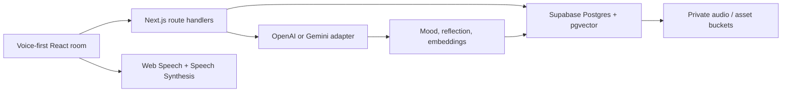

# Lumora — Voice-first reflective companion

Lumora is a polished hackathon starter for a private, AI-powered journal experience. It is intentionally voice-first: the home screen is a reactive procedural SVG companion, not a chat window. The included demo runs without keys; connect OpenAI or Gemini and Supabase to make it persistent.

## What is implemented

- Immersive dark glassmorphism room with particles, parallax-like light, a cursor-following holographic SVG face, motion states, expressive gaze, blinking, listening rings, thinking orbit, and amplitude-driven lips.
- Browser speech recognition and text-to-speech. The app degrades to typing where browser recognition is unavailable.
- Voice commands for **open today’s journal**, **show my insights**, and **search/show memories**.
- Guided AI conversation route with modular OpenAI/Gemini support, safe fallback behavior, input validation, and a focused companion system prompt.
- Journal save API with server-side mood inference in demo mode, journal sheet, mood trend, insight panel, memory dock, and saved-memory feedback.
- Full Supabase schema: profiles, encrypted-at-rest compatible private assets, journals, emotions, tags, goals, habits, conversations, memory graph, reflections, reports, notifications, indexes, vector search function, triggers, and RLS policies.

## Architecture

## Run locally

1. In a terminal, move into this project folder and install dependencies with `npm install`.
2. Copy `.env.example` to `.env.local`.
3. Run `npm run dev` and open [http://localhost:3000](http://localhost:3000).

Without environment variables, Lumora intentionally runs in a visually complete demo mode. The chat uses a thoughtful deterministic fallback and journals stay in the development process memory.

## Connect an AI provider

Set `AI_PROVIDER` to `openai` or `gemini` and add the matching secret key. Keys are accessed only in server route handlers. Do not prefix secret keys with `NEXT_PUBLIC_`.

## Connect Supabase

1. Create a Supabase project and enable email/password or OAuth authentication.
2. Enable the `vector` extension and execute [`supabase/schema.sql`](./supabase/schema.sql) in the SQL editor.
3. Create private Storage buckets named `journal-assets` and `reports`; add Storage RLS policies noted at the bottom of the schema.
4. Add `NEXT_PUBLIC_SUPABASE_URL` and `NEXT_PUBLIC_SUPABASE_ANON_KEY` to `.env.local`.
5. Replace the demo `journal-store.ts` adapter with authenticated Supabase queries. The schema ensures every row is scoped by `auth.uid()`; never pass a service role key to the browser.

## Production hardening checklist

- Add Supabase Auth middleware and enforce a signed-in user in every API route.
- Apply a distributed rate limiter (Upstash/Redis) to chat, transcription, embedding, and report routes.
- Use signed, short-lived upload URLs and validate MIME type, size, and audio duration server-side.
- Generate embeddings and AI analyses in a background queue, with consent and clear data-retention/deletion controls.
- Add regional crisis-resource lookup and human-reviewed safety copy before enabling high-risk support flows.
- Add observability with privacy-preserving error logging, CSRF protection for cookie-based flows, CSP headers, and end-to-end tests.

## Recommended next demo steps

1. Connect a real API key so Lumora can reference journal context.
2. Add a Supabase authentication screen and migrate the included demo entries into a signed-in user’s profile.
3. Record audio in the client, upload with a signed URL, transcribe with Whisper, and save the transcript as a journal asset.
4. Generate weekly reflection and PDF reports in a scheduled server job.

## Privacy note

Lumora is a reflective wellness tool, not a therapist or diagnostic system. Treat sensitive journal content as high-risk personal data: get explicit consent, provide export/delete controls, use private buckets/RLS, and avoid training on user data without a separate opt-in.
